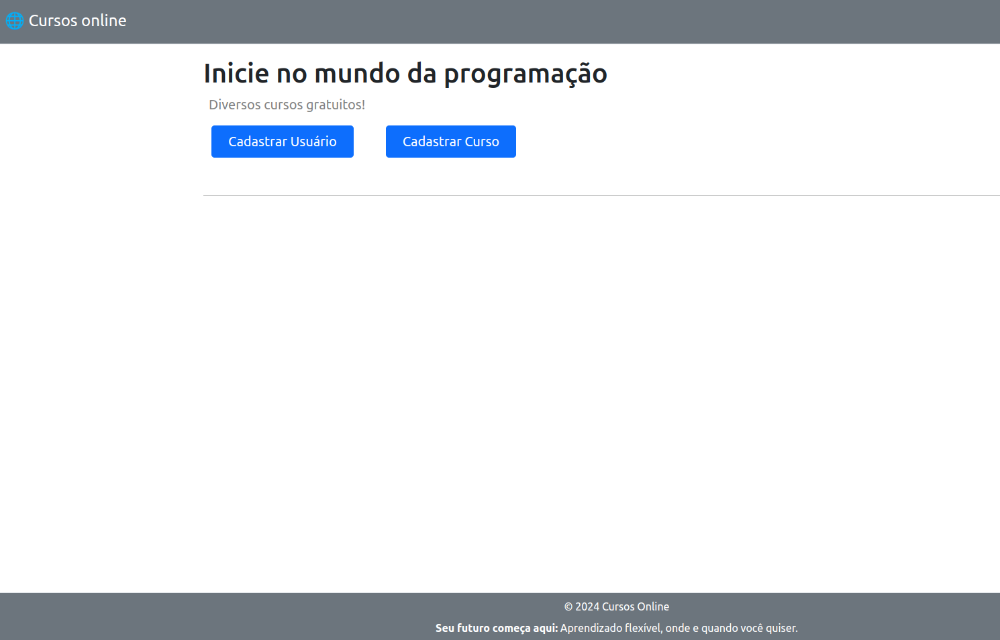
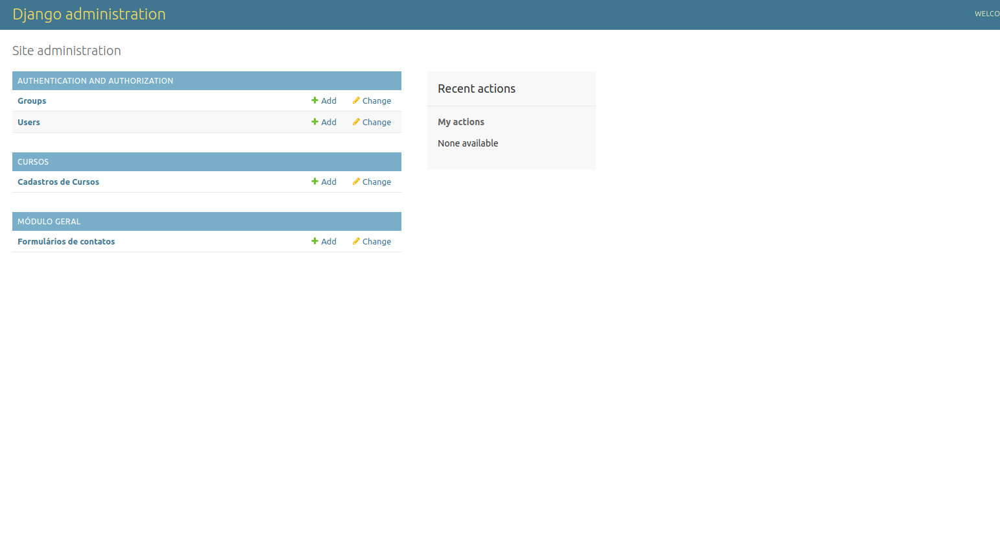
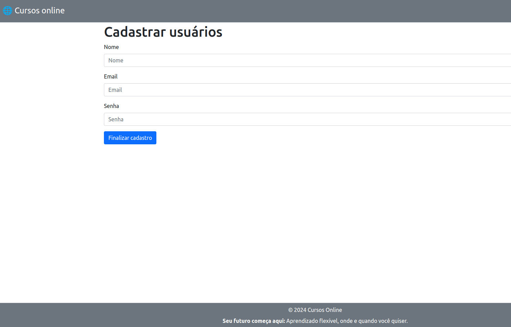
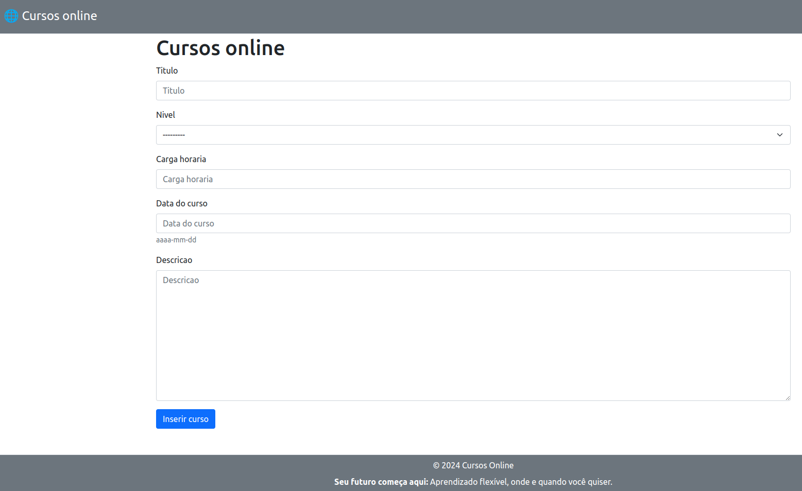

# 🌐 django_web

## 🖼️ Imagens da Aplicação

<table>
  <tr>
    <td align="center">
      
    </td>
    <td align="center">
      
    </td>
  </tr>
  <tr>
    <td align="center">
      
    </td>
    <td align="center">
      
    </td>
  </tr>
</table>


## 📝 Descrição

Este projeto faz parte do módulo de **Django Web** do Bootcamp de Python & Django oferecido pela **WoMakersCode**, em parceria com **iFood**, **Potência Tech** e **Microsoft**. O objetivo do projeto foi praticar os conceitos iniciais de Django criando uma aplicação de cadastros para uma plataforma de cursos online.

O projeto explora os conceitos da arquitetura **MTV** (Model-Template-View) e trabalha com:

- **Templates**: Arquivos HTML que definem a estrutura e o layout das páginas web.
- **Views**: Funções que manipulam as requisições e retornam respostas, geralmente renderizando templates.
- **URLs**: Mapeamento de URLs para views específicas.
- **Models**: Definem a estrutura dos dados e as operações relacionadas ao banco de dados.
- **Forms**: Manipulação e validação de dados do usuário.
- **Admin**: Interface administrativa para gerenciar os dados da aplicação.

## 🚀 Como Iniciar o Projeto

Siga os passos abaixo para configurar e rodar o projeto Django localmente na sua máquina.

### 1.  📥 Clonar o Repositório

Primeiro, clone o repositório para o seu ambiente local e acesse o diretório do projeto:

```bash
git clone <URL_DO_REPOSITORIO>
cd <NOME_DO_PROJETO>

```

### 2. ⚙️ Criar e Ativar o Ambiente Virtual

```bash
python3 -m venv cadastro_curso_womakers

```

### 3. 🔋 Para ativar o ambiente virtual

No Windows:

```bash
cadastro_curso_womakers\Scripts\activate

```

No Linux/macOS:

```bash
source cadastro_curso_womakers/bin/activate

```

### 4. 📦 Instalar as Dependências

```bash
pip install -r requirements.txt

```

### 5. ▶️ Iniciar o servidor

```bash
python3 manage.py runserver

```

### 6. 🗂️ Configurar o Banco de Dados

Sempre que houver alterações nos modelos do Django, execute os seguintes comandos para configurar o banco de dados:

- Gerar arquivos de migração:

```bash
python manage.py makemigrations

```

- Aplicar as migrações ao banco de dados:

```bash
python manage.py migrate

```

### 7. Superusuário
Para acessar o painel administrativo do Django, crie um superusuário:

```bash
python manage.py createsuperuser

```

## 🧪 Testes

Esta aplicação inclui testes para verificar o funcionamento correto dos modelos e das views do app Cursos. Para executar os testes, siga as instruções abaixo.

Para rodar todos os testes da aplicação, utilize o seguinte comando:

```bash
pytest
```
